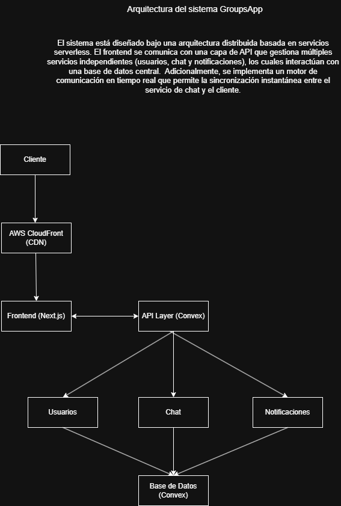
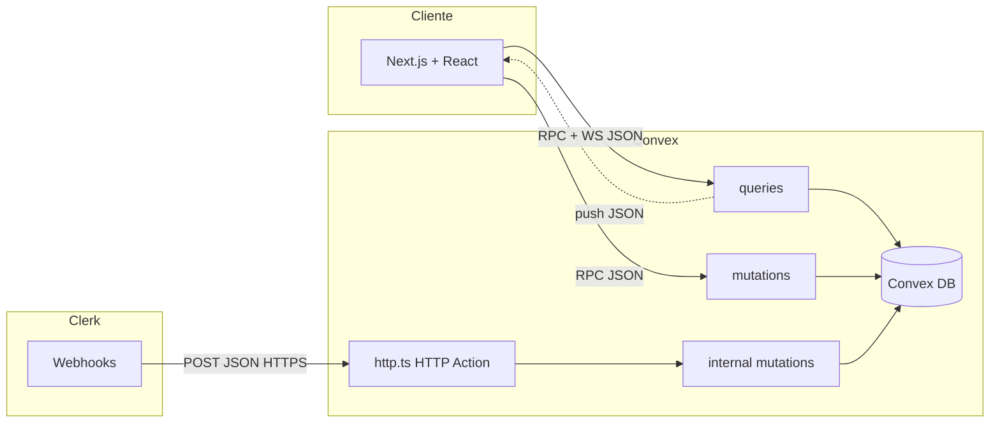
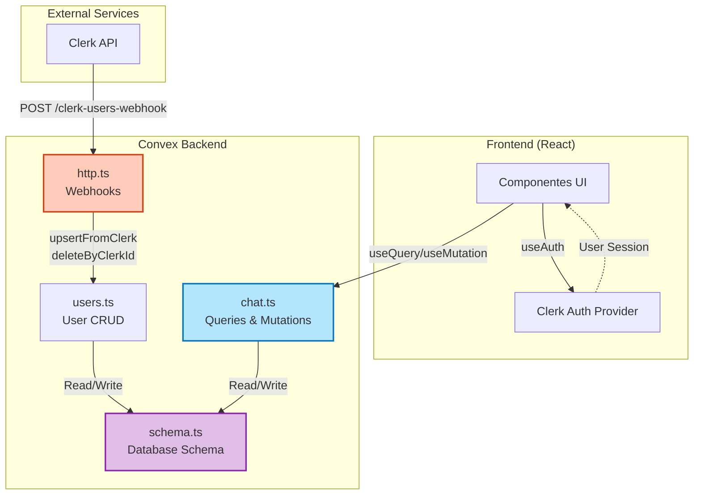
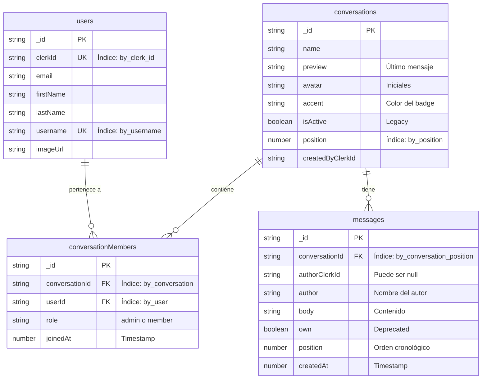
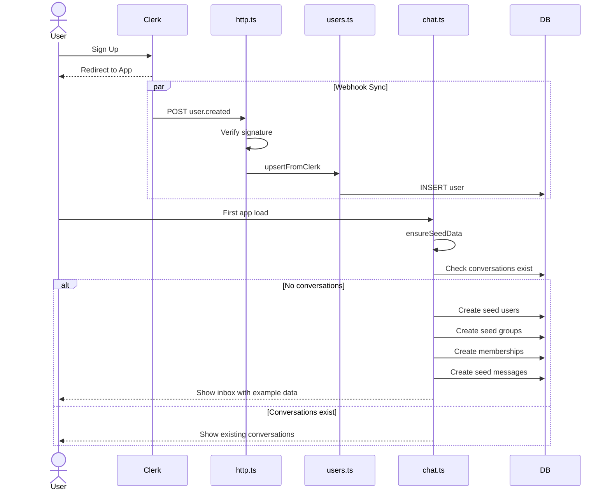
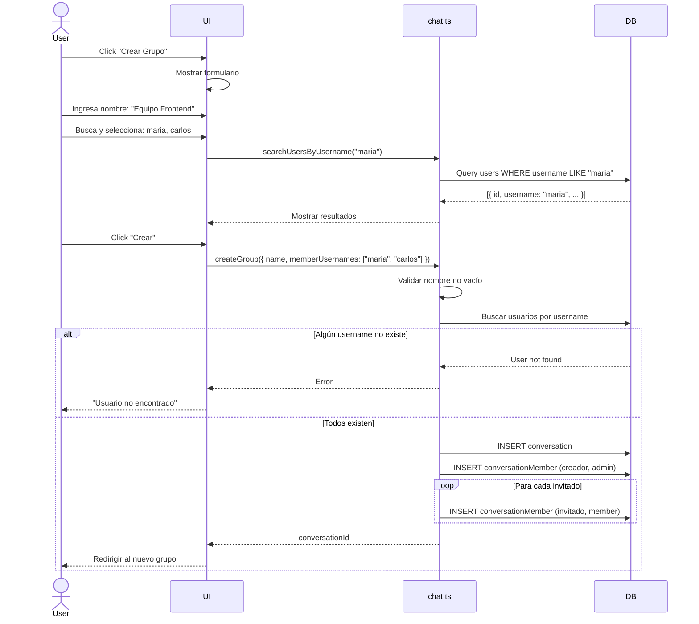
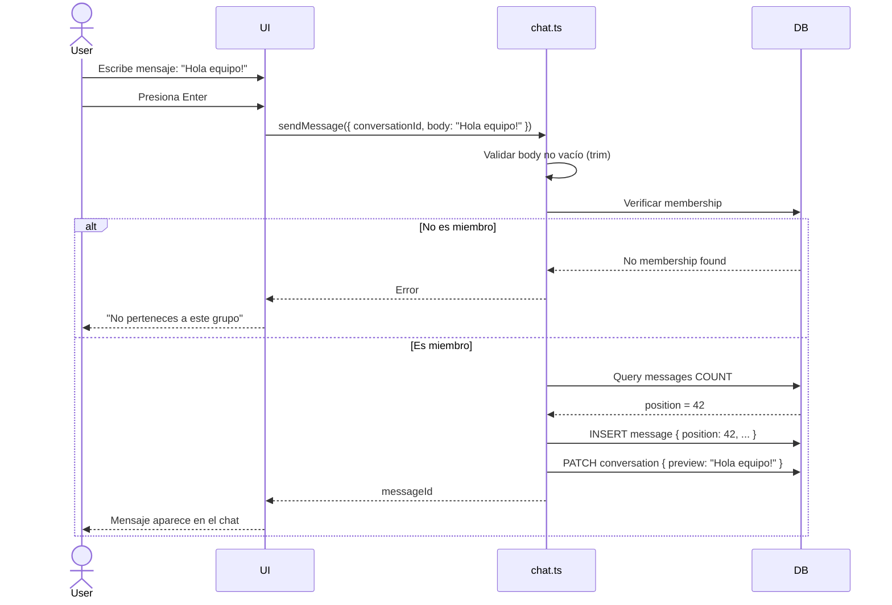
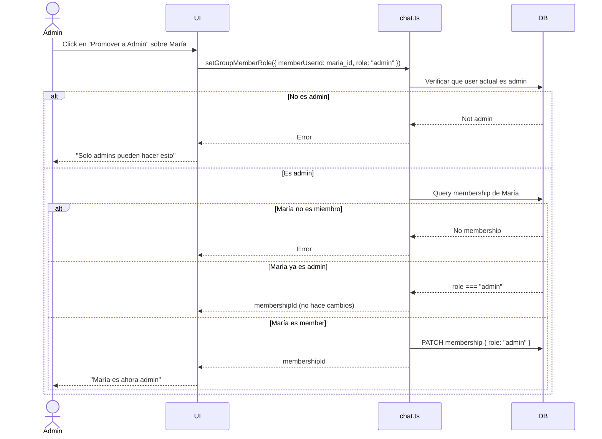
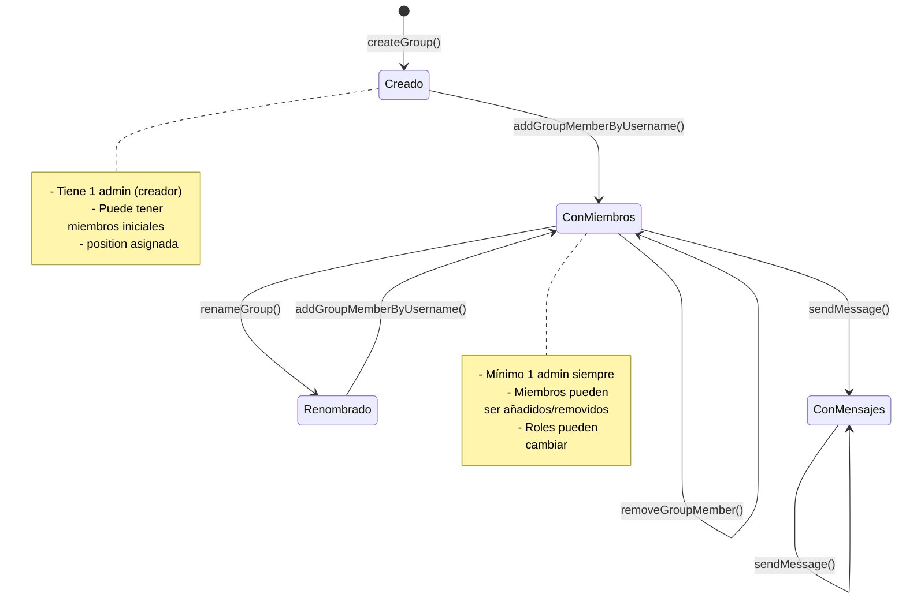

# Arquitectura propuesta


# Comunicaciones en GroupsApp (HTTP, RPC y tiempo real)

Este documento describe cómo se intercambian datos entre el navegador, Clerk, Convex y la base de datos del deployment, usando la nomenclatura habitual de **HTTP** (REST-like), **RPC** (llamadas a funciones Convex) y **MOM** (middleware orientado a mensajes: canal persistente donde los mensajes suelen ir en JSON, p. ej. WebSocket y actualizaciones empujadas).

> **Nota:** En este repo el backend es **Convex**. No hay colas tipo RabbitMQ/Kafka; el patrón “mensaje en JSON por canal” corresponde al **protocolo de sincronización** del cliente Convex (WebSocket) y a los **webhooks** HTTP con cuerpo JSON.

---

## 1. Bases de URL y “URI” por tipo

| Tipo | Host típico | Uso en GroupsApp |
|------|-------------|------------------|
| **API Convex (RPC + suscripciones)** | Valor de `NEXT_PUBLIC_CONVEX_URL` (sufijo `.convex.cloud`) | `ConvexReactClient`: mutaciones, consultas y suscripciones en tiempo real. |
| **HTTP Actions (Convex)** | Mismo *deployment*, dominio **`.convex.site`** | Rutas definidas en `convex/http.ts` (p. ej. webhooks). |
| **Clerk (auth)** | Dominios de Clerk (SDK) | Login, sesión y emisión de JWT hacia el cliente; no es Convex. |

### 1.1 HTTP Actions (Convex)

- **Base:** `https://<nombre-deployment>.convex.site`
- **Ruta en este proyecto:** el `path` registrado en el router (siempre empieza por `/`).

Ejemplo absoluto:

```text
POST https://<nombre-deployment>.convex.site/clerk-users-webhook
```

Definición en código: `convex/http.ts` (`path: "/clerk-users-webhook"`, `method: "POST"`).

### 1.2 RPC y suscripciones (Convex) — “endpoint” lógico

El cliente **no** construye a mano una URI REST por función. Referencia funciones como:

- Módulo: archivo bajo `convex/` sin extensión (`chat`, `users`).
- Export: nombre del handler (`sendMessage`, `getChatData`, …).

Ejemplos lógicos usados desde React (`useQuery` / `useMutation`):

| Función Convex | Tipo | Referencia en cliente |
|----------------|------|------------------------|
| `getChatData` | query | `api.chat.getChatData` |
| `getConversationDetail` | query | `api.chat.getConversationDetail` |
| `searchUsersByUsername` | query | `api.chat.searchUsersByUsername` |
| `ensureSeedData` | mutation | `api.chat.ensureSeedData` |
| `createGroup` | mutation | `api.chat.createGroup` |
| `renameGroup` | mutation | `api.chat.renameGroup` |
| `addGroupMemberByUsername` | mutation | `api.chat.addGroupMemberByUsername` |
| `removeGroupMember` | mutation | `api.chat.removeGroupMember` |
| `setGroupMemberRole` | mutation | `api.chat.setGroupMemberRole` |
| `sendMessage` | mutation | `api.chat.sendMessage` |
| `ensureCurrentUser` | mutation | `api.users.ensureCurrentUser` |

El transporte concreto (HTTP corto o WebSocket) lo negocia el runtime de Convex; a nivel de aplicación solo importa el **nombre de función + argumentos JSON-serializables**.

### 1.3 MOM (tiempo real / mensajes en JSON)

- **Canal:** conexión persistente (típicamente **WebSocket**) entre el navegador y el deployment Convex, asociada a `NEXT_PUBLIC_CONVEX_URL`.
- **Formato:** mensajes **JSON** en el protocolo interno de Convex (suscripción a una query, invalidaciones, entrega de nuevos resultados). La app no define ese esquema a mano; `useQuery` traduce eso a actualizaciones de React.
- **No hay URI por “topic”** escrita por la app: la suscripción identifica la función y los `args` (también JSON).

---

## 2. Usuario (cliente) → servidor

### 2.1 HTTP

| Origen | Destino | Método | URI (patrón) | Cuerpo / cabeceras |
|--------|---------|--------|--------------|---------------------|
| Clerk (servidor de eventos) | Convex HTTP Action | `POST` | `https://<deployment>.convex.site/clerk-users-webhook` | Cuerpo: JSON del evento Clerk (`user.created`, `user.updated`, `user.deleted`). Cabeceras Svix: `svix-id`, `svix-timestamp`, `svix-signature`. |
| Navegador | Next.js (App Router) | `GET` / `POST` (según rutas) | Rutas propias de la app (`/`, `/signup`, `/chat`, …) | HTML, assets; auth vía Clerk en el cliente. |

Respuestas del webhook Convex (implementación actual): JSON con `Content-Type: application/json`, p. ej. `{ "received": true }`, errores `{ "error": "..." }`.

### 2.2 RPC (mutaciones y lecturas puntuales)

Desde `app/chat/chat-shell.tsx` (y patrones equivalentes), el usuario dispara **mutations** que ejecutan lógica en el servidor Convex:

| Mutation | Argumentos principales (resumen) |
|----------|----------------------------------|
| `users.ensureCurrentUser` | `clerkId`, `email?`, `firstName?`, `lastName?`, `username?`, `imageUrl?` |
| `chat.ensureSeedData` | `clerkId`, `email?`, … (mismo perfil de usuario) |
| `chat.sendMessage` | `conversationId`, `currentClerkId`, `body` |
| `chat.createGroup` | `clerkId`, `name`, `memberUsernames[]`, + opcionales de perfil |
| `chat.renameGroup` | `currentClerkId`, `conversationId`, `name` |
| `chat.addGroupMemberByUsername` | `currentClerkId`, `conversationId`, `username` |
| `chat.removeGroupMember` | `currentClerkId`, `conversationId`, `memberUserId` |
| `chat.setGroupMemberRole` | `currentClerkId`, `conversationId`, `memberUserId`, `role` (`admin` \| `member`) |

Los argumentos viajan como **objeto JSON** serializable (Convex valida con `v.*` en cada función).

### 2.3 MOM / tiempo real (suscripciones)

| Patrón | Descripción |
|--------|-------------|
| `useQuery(api.chat.getChatData, { currentClerkId })` | Suscripción: cuando cambian datos relevantes, el servidor **empuja** un nuevo resultado; el cliente actualiza la UI. |
| `useQuery(api.chat.getConversationDetail, { conversationId, currentClerkId })` | Igual: lista de miembros y mensajes se refresca sin polling manual explícito en app. |
| `useQuery(api.chat.searchUsersByUsername, { … })` | Suscripción acorde a `args` (p. ej. `search`); cada cambio de argumentos re-suscribe. |

**Formato de mensaje (conceptual):** pedido de suscripción y actualizaciones = **JSON** en el protocolo Convex; el valor que consume la UI es el **valor de retorno** de la query (objetos anidados con conversaciones, mensajes, etc., según `convex/chat.ts`).

---

## 3. Comunicaciones internas del servidor (Convex)

Aquí “servidor” = runtime Convex que ejecuta `httpAction`, `query` y `mutation`.

| Paso | Tipo | Qué ocurre |
|------|------|------------|
| Webhook Clerk | HTTP → función | `httpAction` en `convex/http.ts` valida firma Svix, parsea JSON y según `event.type` llama a mutaciones **internas**. |
| `user.created` / `user.updated` | RPC interno | `ctx.runMutation(internal.users.upsertFromClerk, { clerkId, email, … })`. |
| `user.deleted` | RPC interno | `ctx.runMutation(internal.users.deleteByClerkId, { clerkId })`. |

Las funciones `internal.users.*` **no** son invocables desde el cliente; solo desde otras funciones Convex (p. ej. el `httpAction`).

No hay en este repo otras `internalQuery` / `internalAction` expuestas para chat; la coordinación extra es principalmente **llamadas directas** entre handlers y `ctx.db` (ver siguiente sección).

---

## 4. Servidor ↔ base de datos

Convex no expone al desarrollador una URI HTTP hacia la BD. El acceso es **API interna** dentro de `query` / `mutation` / `internalMutation`:

- **Lectura:** `ctx.db.query("tabla").withIndex(...).collect()`, `ctx.db.get(id)`, etc.
- **Escritura:** `ctx.db.insert`, `ctx.db.patch`, `ctx.db.delete`.

### 4.1 Tablas usadas en el flujo de chat y usuarios

Definidas en `convex/schema.ts`:

| Tabla | Rol |
|-------|-----|
| `users` | Perfil enlazado a `clerkId`. |
| `conversations` | Grupos / conversaciones. |
| `conversationMembers` | Membresía y rol (`admin` \| `member`). |
| `messages` | Mensajes por `conversationId`. |
| `channelLinks` | Definida en esquema; uso según evolución del producto. |

### 4.2 Flujo típico “usuario envía mensaje”

1. Cliente: `useMutation(api.chat.sendMessage)({ conversationId, currentClerkId, body })` (**RPC**).
2. Servidor (`sendMessage`): valida miembro, calcula `position`, **`ctx.db.insert("messages", …)`**, **`ctx.db.patch(conversationId, { preview })`**.
3. Clientes suscritos a `getChatData` / `getConversationDetail` reciben actualización vía **canal persistente (MOM/WebSocket)**.

---

## 5. Resumen visual



---

## 6. Referencias en el código

- Rutas HTTP: `convex/http.ts`
- RPC público chat: `convex/chat.ts`
- RPC público usuarios: `convex/users.ts` (`ensureCurrentUser`; internas `upsertFromClerk`, `deleteByClerkId`)
- Esquema BD: `convex/schema.ts`
- Cliente Convex: `app/convex-client-provider.tsx` (`NEXT_PUBLIC_CONVEX_URL`)

---

# Convex Backend - GroupsApp

Sistema backend de chat grupal construido con Convex y autenticación Clerk.

---

## Arquitectura General



**Flujo de datos:**
1. Usuario se autentica con Clerk
2. Frontend usa `useQuery` y `useMutation` para comunicarse con Convex
3. Convex ejecuta funciones de `chat.ts` que leen/escriben en la BD
4. Clerk envía webhooks a `http.ts` cuando cambian datos de usuarios
5. `http.ts` sincroniza cambios en la tabla `users` vía `users.ts`

---

## Esquema de Base de Datos



### Tablas

#### **users**
Usuarios sincronizados desde Clerk mediante webhooks.

| Campo | Tipo | Descripción |
|-------|------|-------------|
| `_id` | string | ID generado por Convex (PK) |
| `clerkId` | string | ID único del usuario en Clerk |
| `email` | string? | Email principal |
| `firstName` | string? | Nombre |
| `lastName` | string? | Apellido |
| `username` | string? | Username único |
| `imageUrl` | string? | URL del avatar |

**Índices:**
- `by_clerk_id`: Búsqueda rápida por clerkId (webhooks, autenticación)
- `by_username`: Búsqueda de usuarios al crear/gestionar grupos

---

#### **conversations**
Grupos de chat donde los usuarios pueden enviar mensajes.

| Campo | Tipo | Descripción |
|-------|------|-------------|
| `_id` | string | ID del grupo (PK) |
| `name` | string | Nombre del grupo |
| `preview` | string | Texto preview (último mensaje o descripción) |
| `avatar` | string | Iniciales del grupo (ej: "EF" para "Equipo Frontend") |
| `accent` | string | Color del badge (hex, asignado cíclicamente) |
| `position` | number | Orden en el sidebar |
| `createdByClerkId` | string | ID del usuario que creó el grupo |
| `isActive` | boolean | [Legacy] Ya no se usa |
| `timeLabel` | string? | [Legacy] Ya no se usa |

**Índices:**
- `by_position`: Ordena grupos en el sidebar

---

#### **conversationMembers**
Tabla de relación N:M entre usuarios y grupos, con información de rol.

| Campo | Tipo | Descripción |
|-------|------|-------------|
| `_id` | string | ID de la membresía (PK) |
| `conversationId` | Id<conversations> | Grupo al que pertenece |
| `userId` | Id<users> | Usuario miembro |
| `role` | "admin" \| "member" | Rol en el grupo |
| `joinedAt` | number | Timestamp de cuándo se unió |

**Roles:**
- `admin`: Puede renombrar grupo, añadir/remover miembros, cambiar roles
- `member`: Solo puede enviar mensajes

**Reglas de negocio:**
- Cada grupo debe tener al menos 1 admin
- No se puede eliminar al último admin
- Solo admins pueden gestionar el grupo

**Índices:**
- `by_conversation`: Listar miembros de un grupo
- `by_user`: Listar grupos de un usuario
- `by_conversation_user`: Verificar si un usuario es miembro (auth)

---

#### **messages**
Mensajes enviados dentro de conversaciones.

| Campo | Tipo | Descripción |
|-------|------|-------------|
| `_id` | string | ID del mensaje (PK) |
| `conversationId` | Id<conversations> | Grupo donde se envió |
| `authorClerkId` | string? | ID del autor en Clerk (null en seed) |
| `author` | string | Nombre del autor (guardado por performance) |
| `body` | string | Contenido del mensaje |
| `position` | number | Orden cronológico dentro del grupo (0, 1, 2...) |
| `createdAt` | number | Timestamp de creación |
| `own` | boolean | [Deprecated] Se calcula en el cliente |
| `timeLabel` | string? | [Legacy] Ya no se usa |

**Índices:**
- `by_conversation_position`: Cargar mensajes de un grupo ordenados

---

## Estructura de Archivos

```
convex/
├── _generated/          # Código autogenerado por Convex
├── schema.ts            # Definición del esquema de BD
├── users.ts             # CRUD básico de usuarios
├── http.ts              # Webhooks HTTP (Clerk sync)
├── chat.ts              # Lógica principal de chat y grupos
├── tsconfig.json        # Configuración TypeScript
└── README.md            # Esta documentación
```

### **schema.ts** (52 líneas)
Define el esquema de la base de datos usando `defineSchema` de Convex.

**Responsabilidad:**
- Definir estructura de tablas (fields y tipos)
- Crear índices para optimizar queries
- Validación de tipos en runtime

**Convenciones:**
- Todos los campos opcionales usan `v.optional()`
- Los IDs foráneos usan `v.id("tabla")`
- Los índices se nombran `by_campo` o `by_campo1_campo2`

---

### **users.ts** (79 líneas)
Gestión de usuarios: crear, actualizar y eliminar.

**Funciones exportadas:**
- `upsertFromClerk` (internal): Sincroniza usuarios desde webhooks
- `ensureCurrentUser` (mutation): Crea/actualiza usuario desde el cliente
- `deleteByClerkId` (internal): Elimina usuario cuando se borra en Clerk

**Cuándo se usa:**
- Al recibir webhooks de Clerk (create, update, delete)
- Al hacer login/signup desde el frontend
- Al actualizar perfil de usuario

---

### **http.ts** (215 líneas)
Maneja webhooks HTTP desde servicios externos.

**Endpoints:**
- `POST /clerk-users-webhook`: Sincroniza usuarios desde Clerk

**Eventos procesados:**
- `user.created`: Crea nuevo usuario en Convex
- `user.updated`: Actualiza datos del usuario
- `user.deleted`: Elimina usuario de Convex

**Seguridad:**
- Verificación de firma HMAC-SHA256 con Svix
- Validación de timestamp (máx 5 min)
- Constant-time comparison (previene timing attacks)

**Variables de entorno:**
- `CLERK_WEBHOOK_SIGNING_SECRET`: Secret para verificar webhooks

---

### **chat.ts** (873 líneas)
Lógica principal de la aplicación de chat grupal.

**Queries (lectura):**
- `getChatData`: Lista de grupos e inbox
- `getConversationDetail`: Detalles de un grupo (miembros, mensajes)
- `searchUsersByUsername`: Búsqueda de usuarios para añadir

**Mutations (escritura):**
- `ensureSeedData`: Crea datos de ejemplo para nuevos usuarios
- `createGroup`: Crea nuevo grupo con miembros
- `renameGroup`: Cambia nombre del grupo
- `addGroupMemberByUsername`: Añade miembro por username
- `removeGroupMember`: Elimina miembro del grupo
- `setGroupMemberRole`: Cambia rol admin/member
- `sendMessage`: Envía mensaje a un grupo

**Helpers internos:**
- Validación de usuarios y permisos
- Formateo de datos (nombres, iniciales, labels)
- Búsqueda y conteo de membresías

---

## Flujos Principales

### 1. Onboarding de Usuario Nuevo



**Pasos:**
1. Usuario se registra en Clerk
2. Clerk envía webhook `user.created` a Convex
3. `http.ts` verifica la firma y llama a `users.upsertFromClerk`
4. Usuario carga la app por primera vez
5. Frontend llama a `ensureSeedData` que crea grupos de ejemplo
6. Usuario ve inbox con conversaciones iniciales

---

### 2. Creación de Grupo



**Pasos:**
1. Usuario abre modal de crear grupo
2. Ingresa nombre y busca miembros con búsqueda en vivo
3. Selecciona miembros y crea el grupo
4. Sistema valida que todos los usernames existan
5. Crea conversación y añade membresías
6. Redirige al usuario al nuevo grupo

---

### 3. Envío de Mensaje



**Pasos:**
1. Usuario escribe mensaje en el input
2. Presiona Enter o click en enviar
3. Sistema valida que el mensaje no esté vacío
4. Verifica que el usuario sea miembro del grupo
5. Calcula position basado en mensajes existentes
6. Crea el mensaje y actualiza el preview del grupo
7. Mensaje aparece en tiempo real (reactivity de Convex)

---

### 4. Gestión de Permisos (Promover a Admin)



**Reglas de permisos:**
- Solo admins pueden cambiar roles
- Se puede promover a múltiples admins
- No se puede degradar al último admin
- Los cambios son inmediatos (reactivity)

---

##  Seguridad y Permisos

### Autenticación
- **Frontend**: Clerk maneja autenticación y sesiones
- **Backend**: Todas las funciones reciben `currentClerkId` del usuario autenticado
- **Webhooks**: Verificación de firma HMAC-SHA256 con secret compartido

### Autorización

#### Roles en grupos:
| Rol | Permisos |
|-----|----------|
| **admin** | ✅ Renombrar grupo<br>✅ Añadir/remover miembros<br>✅ Cambiar roles<br>✅ Enviar mensajes |
| **member** | ❌ Gestionar grupo<br>✅ Enviar mensajes |

#### Validaciones implementadas:

**En queries:**
- Usuario debe existir en BD (`getUserByClerkId`)
- Usuario debe ser miembro del grupo para ver mensajes
- Solo admins pueden buscar usuarios para añadir

**En mutations:**
- `requireUserByClerkId`: Lanza error si el usuario no existe
- `requireAdminMembership`: Verifica rol de admin
- `getConversationMembership`: Verifica membresía específica
- Validación de "último admin": No se puede eliminar o degradar

**En webhooks:**
- Verificación de firma Svix (HMAC-SHA256)
- Constant-time comparison para prevenir timing attacks
- Validación de timestamp (máx 5 minutos)

---

##  Guía de Desarrollo

### Prerrequisitos
- Node.js 18+
- npm o pnpm
- Cuenta de Convex
- Cuenta de Clerk

### Setup inicial

1. **Instalar Convex:**
```bash
npm install convex
```

2. **Iniciar Convex Dev:**
```bash
npx convex dev
```

3. **Configurar Clerk Webhook:**
   - Ir a [Clerk Dashboard](https://dashboard.clerk.com) → Webhooks
   - Añadir endpoint: `https://your-app.convex.site/clerk-users-webhook`
   - Suscribirse a: `user.created`, `user.updated`, `user.deleted`
   - Copiar Signing Secret
   - Añadir a variables de entorno de Convex:
     ```bash
     npx convex env set CLERK_WEBHOOK_SIGNING_SECRET whsec_xxx
     ```

### Testing de funciones

**Queries (desde el frontend):**
```typescript
import { useQuery } from "convex/react";
import { api } from "@/convex/_generated/api";

function ChatInbox() {
  const chatData = useQuery(api.chat.getChatData, {
    currentClerkId: user?.id
  });
  
  return <div>{chatData?.inboxItems.map(...)}</div>;
}
```

**Mutations (desde el frontend):**
```typescript
import { useMutation } from "convex/react";
import { api } from "@/convex/_generated/api";

function CreateGroupButton() {
  const createGroup = useMutation(api.chat.createGroup);
  
  const handleCreate = async () => {
    const groupId = await createGroup({
      clerkId: user.id,
      name: "Nuevo Grupo",
      memberUsernames: ["maria"]
    });
  };
}
```

**Testing en Convex Dashboard:**
1. Ir a https://dashboard.convex.dev
2. Seleccionar tu proyecto
3. Ir a "Functions"
4. Seleccionar función y ejecutar con datos de prueba

### Convenciones del código

**Naming:**
- Queries: `get*`, `search*`, `list*`
- Mutations: `create*`, `update*`, `delete*`, `add*`, `remove*`, `set*`
- Helpers internos: camelCase sin prefijo
- Helpers de validación: `require*` (lanzan error), `get*` (retornan null)

**Error handling:**
- Usar `throw new Error(mensaje)` con mensajes en español
- Validar inputs al inicio de la función
- Mensajes descriptivos para el usuario

**Performance:**
- Usar índices para búsquedas frecuentes
- `Promise.all` para queries paralelas
- Evitar queries dentro de loops (cargar todo y filtrar en memoria)

---

## 📚 Referencia de API

### schema.ts

#### Tabla: **users**

Usuarios de la aplicación, sincronizados desde Clerk.

**Campos:**
- `clerkId` (string): ID único del usuario en Clerk (requerido)
- `email` (string, opcional): Email principal del usuario
- `firstName` (string, opcional): Nombre
- `lastName` (string, opcional): Apellido
- `username` (string, opcional): Username único
- `imageUrl` (string, opcional): URL del avatar del usuario

**Índices:**
- `by_clerk_id`: Búsqueda rápida por ID de Clerk (usado en webhooks y autenticación)
- `by_username`: Búsqueda de usuarios al crear grupos o añadir miembros

---

#### Tabla: **conversations**

Conversaciones (grupos de chat).

**Campos clave:**
- `name` (string): Nombre del grupo mostrado en la UI
- `preview` (string): Texto preview (último mensaje o descripción inicial)
- `avatar` (string): Iniciales del grupo (calculadas automáticamente del nombre)
- `accent` (string): Color del badge del grupo (asignado cíclicamente de groupAccents)
- `position` (number): Orden visual en el sidebar (índice numérico)
- `isActive` (boolean): [Legacy] Ya no se usa en la lógica actual, mantener por compatibilidad
- `createdByClerkId` (string): ID del usuario que creó el grupo

**Índice:**
- `by_position`: Ordena grupos en el sidebar de menor a mayor

---

#### Tabla: **conversationMembers**

Membresías de usuarios en conversaciones. Implementa la relación N:M entre users y conversations.

**Campos:**
- `conversationId` (Id<"conversations">): ID del grupo
- `userId` (Id<"users">): ID del usuario
- `role` ("admin" | "member"): Rol en el grupo
  - `admin`: Puede gestionar grupo
  - `member`: Solo participa
- `joinedAt` (number): Timestamp de cuándo se unió al grupo

**Reglas de negocio:**
- Cada grupo debe tener al menos 1 admin
- No se puede eliminar al último admin de un grupo
- Solo admins pueden añadir/remover miembros o cambiar roles

**Índices críticos:**
- `by_conversation`: Listar todos los miembros de un grupo específico
- `by_user`: Listar todos los grupos donde un usuario es miembro
- `by_conversation_user`: Verificar si un usuario es miembro de un grupo (auth)

---

#### Tabla: **messages**

Mensajes dentro de conversaciones.

**Campos:**
- `conversationId` (Id<"conversations">): Grupo al que pertenece el mensaje
- `authorClerkId` (string, opcional): ID del autor en Clerk (opcional para mensajes de seed)
- `author` (string): Nombre del autor (almacenado por performance)
- `body` (string): Contenido del mensaje
- `position` (number): Orden cronológico dentro del grupo (0, 1, 2, ...)
- `createdAt` (number): Timestamp de creación del mensaje
- `own` (boolean): [Deprecated] Se calcula en el cliente, no usar en queries
- `timeLabel` (string, opcional): [Legacy] Label de tiempo (ya no se usa)

**Índices:**
- `by_position`: Orden global de mensajes (no muy útil)
- `by_conversation_position`: Cargar mensajes de un grupo ordenados cronológicamente

---

### users.ts

#### `upsertFromClerk`

**Tipo:** Internal Mutation

**Descripción:** Crea o actualiza un usuario desde un webhook de Clerk. Esta función es llamada automáticamente por http.ts cuando Clerk envía eventos user.created o user.updated al webhook.

**Parámetros:**
- `clerkId` (string): ID único del usuario en Clerk
- `email` (string, opcional): Email principal del usuario
- `firstName` (string, opcional): Nombre
- `lastName` (string, opcional): Apellido
- `username` (string, opcional): Username único en Clerk
- `imageUrl` (string, opcional): URL del avatar del usuario

**Retorna:** ID del usuario en la base de datos de Convex

**Comportamiento:**
- Si el usuario existe (por clerkId), actualiza sus datos
- Si no existe, lo crea como nuevo registro

**Ejemplo:**
```typescript
// Llamado automáticamente desde http.ts:
await ctx.runMutation(internal.users.upsertFromClerk, {
  clerkId: "user_2abc123...",
  email: "juan@example.com",
  username: "juanperez"
});
```

---

#### `ensureCurrentUser`

**Tipo:** Mutation

**Descripción:** Asegura que el usuario actual existe en la base de datos. Similar a upsertFromClerk pero puede ser llamada desde el cliente. Útil para garantizar sincronización cuando el usuario inicia sesión o cuando se necesita actualizar datos del perfil.

**Parámetros:**
- `clerkId` (string): ID del usuario autenticado
- `email` (string, opcional): Email del usuario
- `firstName` (string, opcional): Nombre del usuario
- `lastName` (string, opcional): Apellido del usuario
- `username` (string, opcional): Username del usuario
- `imageUrl` (string, opcional): URL del avatar

**Retorna:** ID del usuario en Convex

**Ejemplo:**
```typescript
// Desde el frontend al iniciar sesión:
const userId = await ensureCurrentUser({
  clerkId: user.id,
  email: user.primaryEmailAddress?.emailAddress,
  username: user.username,
  firstName: user.firstName,
  imageUrl: user.imageUrl
});
```

---

#### `deleteByClerkId`

**Tipo:** Internal Mutation

**Descripción:** Elimina un usuario cuando es borrado en Clerk.

**Parámetros:**
- `clerkId` (string): ID del usuario a eliminar

**Retorna:** ID del usuario eliminado o null si no existía

**Nota importante:** NO elimina en cascada conversationMembers ni messages. Los mensajes del usuario quedan "huérfanos" con authorClerkId pero sin registro de usuario asociado. Esto es intencional para mantener historial de chat.

**Ejemplo:**
```typescript
// Llamado desde http.ts cuando Clerk envía user.deleted:
await ctx.runMutation(internal.users.deleteByClerkId, {
  clerkId: "user_2abc123..."
});
```

---

### http.ts

#### Webhook: `/clerk-users-webhook`

**Endpoint:** `POST /clerk-users-webhook`

**Descripción:** Webhook para sincronizar usuarios desde Clerk.

**Flujo de procesamiento:**
1. Valida que exista `CLERK_WEBHOOK_SIGNING_SECRET` en env
2. Extrae headers de Svix (svix-id, svix-timestamp, svix-signature)
3. Verifica firma HMAC-SHA256 del payload con el secret
4. Valida que el timestamp no tenga más de 5 minutos de antigüedad
5. Parsea el evento JSON del body
6. Procesa según tipo de evento:
   - `user.created/updated` → upsertFromClerk
   - `user.deleted` → deleteByClerkId
7. Retorna 200 OK si se procesó correctamente

**Seguridad implementada:**
- Verificación de firma criptográfica HMAC-SHA256
- Constant-time comparison para prevenir timing attacks
- Validación de timestamp para prevenir replay attacks
- Validación de headers requeridos

**Errores posibles:**
- 500: Missing CLERK_WEBHOOK_SIGNING_SECRET
- 400: Missing Svix headers
- 400: Invalid signature
- 400: Expired timestamp (>5 min)
- 400: Missing Clerk user id (en user.deleted)

**Configuración en Clerk Dashboard:**
1. Ir a Webhooks → Add Endpoint
2. URL: `https://your-app.convex.site/clerk-users-webhook`
3. Subscribe to events: user.created, user.updated, user.deleted
4. Copiar el Signing Secret
5. Añadirlo a .env.local como `CLERK_WEBHOOK_SIGNING_SECRET`

---

#### `verifyWebhook`

**Descripción:** Verifica la autenticidad de un webhook de Clerk usando Svix. Implementa el algoritmo de verificación de Svix según su documentación oficial.

**Pasos de verificación:**
1. Valida que el timestamp sea un número válido
2. Verifica que el timestamp no tenga más de 5 minutos de diferencia con la hora actual
3. Decodifica el secret de base64 (remueve prefijo 'whsec_' si existe)
4. Genera HMAC-SHA256 del payload: sign(secret, svixId + timestamp + body)
5. Parsea las firmas del header svix-signature (formato: "v1,signature v1,signature2")
6. Compara la firma calculada con las firmas recibidas usando constant-time comparison
7. Si alguna firma coincide, el webhook es válido

**Parámetros:**
- `body` (string): Cuerpo del request en formato string
- `secret` (string): CLERK_WEBHOOK_SIGNING_SECRET
- `svixId` (string): Header svix-id del request
- `svixTimestamp` (string): Header svix-timestamp del request (segundos Unix)
- `svixSignature` (string): Header svix-signature del request

**Lanza error si:**
- El timestamp es inválido o expirado (>5 min)
- Ninguna firma coincide con la calculada

**Seguridad:**
- Usa constant-time comparison para prevenir timing attacks
- Valida timestamp para prevenir replay attacks
- Soporta múltiples firmas en el header (rotación de secrets)

---

#### `constantTimeEqual`

**Descripción:** Compara dos arrays de bytes en tiempo constante. Previene timing attacks al comparar firmas criptográficas. Siempre recorre TODOS los bytes sin hacer short-circuit, independientemente de si encuentra diferencias.

**Funcionamiento:**
- Usa XOR bitwise para comparar cada byte
- Acumula diferencias en la variable mismatch
- Retorna true solo si mismatch === 0

**Parámetros:**
- `left` (Uint8Array): Primer array a comparar
- `right` (Uint8Array): Segundo array a comparar

**Retorna:** true si los arrays son idénticos, false en caso contrario

**Nota de seguridad CRÍTICA:** No usar `===` normal para comparar firmas, permite timing attacks. Esta función siempre toma el mismo tiempo independientemente de dónde estén las diferencias.

**Ejemplo:**
```typescript
// MAL - vulnerable a timing attacks:
if (signature1 === signature2) { ... }

// BIEN - tiempo constante:
if (constantTimeEqual(signature1, signature2)) { ... }
```

---

### chat.ts

#### `getChatData`

**Tipo:** Query

**Descripción:** Obtiene todos los datos necesarios para renderizar el inbox de chat.

**Retorna:**
- `workspace`: Información del workspace (nombre, iniciales)
- `inboxItems`: Lista de conversaciones con preview y metadata
- `channels`: Enlaces de acciones (Crear grupo, Administrar miembros)
- `activeConversationId`: ID de la conversación seleccionada (primera por defecto)

**Información por conversación:**
- `id`, `name`, `avatar`, `accent`: Datos básicos del grupo
- `preview`: Último mensaje o descripción inicial
- `createdAt`: Timestamp del último mensaje o del grupo
- `membersLabel`: Texto formateado "X miembro(s)"
- `active`: Si está seleccionada actualmente

**Parámetros:**
- `currentClerkId` (string, opcional): ID del usuario autenticado

**Performance:**
- Usa Promise.all para 3 queries paralelas (conversations, memberships, messages)
- Filtra en memoria las conversaciones donde el usuario es miembro
- Considerado acceptable por el volumen esperado de datos

**Ejemplo:**
```typescript
// Desde el frontend:
const chatData = useQuery(api.chat.getChatData, {
  currentClerkId: user?.id
});

// chatData.inboxItems = [
//   { id: "123", name: "General", avatar: "GE", preview: "Último mensaje...", ... }
// ]
```

---

#### `getConversationDetail`

**Tipo:** Query

**Descripción:** Obtiene detalles completos de una conversación específica.

**Retorna:**
- `activeConversation`: Info del grupo con permisos del usuario actual
- `members`: Lista de miembros con roles y permisos de gestión
- `messages`: Todos los mensajes ordenados cronológicamente

**Información de la conversación:**
- `id`, `name`, `membersLabel`: Datos básicos
- `badge`, `badgeColor`: Avatar e iniciales
- `canManageGroup`: Si el usuario actual es admin

**Información por miembro:**
- `id`, `displayName`, `username`, `role`: Datos del miembro
- `isCurrentUser`: Si es el usuario autenticado
- `canRemove`: Si el usuario actual puede removerlo (no a sí mismo, no al último admin)
- `canToggleAdmin`: Si puede cambiar su rol (no al último admin)

**Información por mensaje:**
- `id`, `author`, `body`: Datos del mensaje
- `createdAt`: Timestamp
- `own`: Si fue enviado por el usuario actual

**Parámetros:**
- `conversationId` (Id<"conversations">, opcional): ID del grupo a cargar (usa el primero si no se especifica)
- `currentClerkId` (string, opcional): ID del usuario autenticado

**Ejemplo:**
```typescript
// Desde el frontend:
const detail = useQuery(api.chat.getConversationDetail, {
  conversationId: selectedGroupId,
  currentClerkId: user?.id
});

// detail.members = [
//   { 
//     displayName: "Juan Pérez", 
//     role: "admin", 
//     isCurrentUser: true,
//     canRemove: false,
//     canToggleAdmin: false
//   }
// ]
```

---

#### `searchUsersByUsername`

**Tipo:** Query

**Descripción:** Busca usuarios por username para añadir a grupos.

**Características:**
- Búsqueda case-insensitive (convierte a lowercase)
- Excluye al usuario actual de los resultados
- Marca usuarios que ya son miembros del grupo (alreadyMember: true)
- Límite de 5 resultados máximo
- Solo admins pueden buscar (si se especifica conversationId)

**Parámetros:**
- `currentClerkId` (string, opcional): Usuario que realiza la búsqueda
- `conversationId` (Id<"conversations">, opcional): Grupo donde se añadirá el usuario
- `search` (string): Texto a buscar en usernames

**Retorna:** Lista de usuarios encontrados con flag alreadyMember, o array vacío si:
- search está vacío
- no hay usuario autenticado
- el usuario no es admin del grupo

**Ejemplo:**
```typescript
// Desde el frontend (al crear grupo):
const users = useQuery(api.chat.searchUsersByUsername, {
  currentClerkId: user?.id,
  search: searchTerm
});

// Desde el frontend (al añadir a grupo existente):
const users = useQuery(api.chat.searchUsersByUsername, {
  currentClerkId: user?.id,
  conversationId: groupId,
  search: searchTerm
});

// users = [
//   { id: "123", username: "juanp", displayName: "Juan Pérez", alreadyMember: false },
//   { id: "456", username: "juan123", displayName: "Juan García", alreadyMember: true }
// ]
```

---

#### `createGroup`

**Tipo:** Mutation

**Descripción:** Crea un nuevo grupo de chat con miembros iniciales.

**Flujo de creación:**
1. Valida que el nombre no esté vacío (hace trim)
2. Upsert del usuario creador (por si no existe en BD)
3. Resuelve usernames a IDs de usuarios (falla si alguno no existe)
4. Crea la conversación con:
   - Avatar: iniciales del nombre
   - Accent: color cíclico de groupAccents
   - Position: número de conversaciones existentes
5. Añade creador como admin
6. Añade invitados como members (filtra al creador si está en la lista)

**Parámetros:**
- `clerkId` (string): ID del creador en Clerk
- `name` (string): Nombre del grupo (requerido, se hace trim)
- `memberUsernames` (string[]): Array de usernames a invitar
- `email`, `firstName`, `lastName`, `username`, `imageUrl` (opcionales): Datos del creador para upsert

**Retorna:** ID de la conversación creada

**Lanza error si:**
- El nombre está vacío después de trim
- Algún username no existe en la base de datos

**Ejemplo:**
```typescript
// Desde el frontend:
const groupId = await createGroup({
  clerkId: user.id,
  email: user.emailAddresses[0]?.emailAddress,
  firstName: user.firstName,
  username: user.username,
  name: "Equipo Frontend",
  memberUsernames: ["maria", "carlos", "ana"]
});
```

---

#### `renameGroup`

**Tipo:** Mutation

**Descripción:** Cambia el nombre de un grupo existente.

**Restricciones:**
- Solo admins del grupo pueden renombrarlo
- El nombre no puede estar vacío

**Efectos:**
- Actualiza el campo `name`
- Recalcula el `avatar` (iniciales del nuevo nombre)

**Parámetros:**
- `currentClerkId` (string): Usuario que realiza el cambio (debe ser admin)
- `conversationId` (Id<"conversations">): ID del grupo a renombrar
- `name` (string): Nuevo nombre del grupo (se hace trim)

**Retorna:** ID de la conversación modificada

**Lanza error si:**
- El usuario no es admin del grupo
- El nombre está vacío después de trim

**Ejemplo:**
```typescript
await renameGroup({
  currentClerkId: user.id,
  conversationId: groupId,
  name: "Nuevo nombre del equipo"
});
```

---

#### `addGroupMemberByUsername`

**Tipo:** Mutation

**Descripción:** Añade un miembro a un grupo por su username.

**Reglas de negocio:**
- Solo admins pueden añadir miembros
- El usuario a añadir debe existir en la base de datos
- No se puede añadir si ya es miembro (retorna error específico)
- El nuevo miembro se añade con rol "member" (no admin)

**Parámetros:**
- `currentClerkId` (string): Admin que añade al miembro
- `conversationId` (Id<"conversations">): Grupo donde añadir
- `username` (string): Username del usuario a añadir (se hace trim)

**Retorna:**
- `{ ok: true, memberUserId: Id }` si se añadió correctamente
- `{ ok: false, code: "user_not_found" }` si el username no existe
- `{ ok: false, code: "already_member" }` si ya está en el grupo

**Lanza error si:** El usuario actual no es admin del grupo

**Ejemplo:**
```typescript
const result = await addGroupMemberByUsername({
  currentClerkId: user.id,
  conversationId: groupId,
  username: "nuevomiembro"
});

if (result.ok) {
  console.log("Miembro añadido:", result.memberUserId);
} else if (result.code === "user_not_found") {
  alert("Usuario no encontrado");
} else if (result.code === "already_member") {
  alert("Ya es miembro del grupo");
}
```

---

#### `removeGroupMember`

**Tipo:** Mutation

**Descripción:** Elimina un miembro de un grupo.

**Restricciones:**
- Solo admins pueden remover miembros
- No puedes quitarte a ti mismo (usar otra acción para eso)
- No se puede remover al último admin del grupo

**Parámetros:**
- `currentClerkId` (string): Admin que remueve al miembro
- `conversationId` (Id<"conversations">): Grupo del que remover
- `memberUserId` (Id<"users">): ID del usuario a remover

**Retorna:** ID de la membresía eliminada

**Lanza error si:**
- El usuario actual no es admin
- Intenta quitarse a sí mismo
- El usuario no pertenece al grupo
- Intenta remover al último admin

**Ejemplo:**
```typescript
await removeGroupMember({
  currentClerkId: user.id,
  conversationId: groupId,
  memberUserId: userToRemoveId
});
```

---

#### `setGroupMemberRole`

**Tipo:** Mutation

**Descripción:** Cambia el rol de un miembro entre admin y member.

**Casos de uso:**
- Promover member a admin
- Degradar admin a member

**Restricciones críticas:**
- Solo admins pueden cambiar roles
- No se puede degradar al último admin del grupo
- El cambio debe modificar el rol actual (si ya tiene ese rol, es noop)
- No hay restricción en promover a múltiples admins

**Parámetros:**
- `currentClerkId` (string): Admin que realiza el cambio
- `conversationId` (Id<"conversations">): Grupo donde se cambia el rol
- `memberUserId` (Id<"users">): Usuario cuyo rol se cambiará
- `role` ("admin" | "member"): Nuevo rol

**Retorna:** ID de la membresía modificada

**Lanza error si:**
- El usuario actual no es admin
- El usuario no es miembro del grupo
- Se intenta degradar al último admin

**Ejemplo:**
```typescript
// Promover a admin:
await setGroupMemberRole({
  currentClerkId: user.id,
  conversationId: groupId,
  memberUserId: targetUserId,
  role: "admin"
});

// Degradar a member:
await setGroupMemberRole({
  currentClerkId: user.id,
  conversationId: groupId,
  memberUserId: targetUserId,
  role: "member"
});
```

---

#### `sendMessage`

**Tipo:** Mutation

**Descripción:** Envía un mensaje a una conversación.

**Validaciones:**
- El mensaje no puede estar vacío (se hace trim)
- El usuario debe ser miembro del grupo

**Comportamiento:**
- Calcula `position` basado en mensajes existentes (count)
- Guarda nombre del autor (getUserDisplayName) para performance
- Actualiza el `preview` de la conversación con el texto del mensaje
- Genera timestamp con Date.now()

**Parámetros:**
- `conversationId` (Id<"conversations">): Grupo donde enviar el mensaje
- `currentClerkId` (string): Usuario que envía el mensaje
- `body` (string): Contenido del mensaje (se hace trim)

**Retorna:** ID del mensaje creado

**Lanza error si:**
- El mensaje está vacío después de trim
- El usuario no es miembro del grupo

**Ejemplo:**
```typescript
const messageId = await sendMessage({
  conversationId: groupId,
  currentClerkId: user.id,
  body: "Hola a todos!"
});
```

---

##  Diagramas de Estado

### Estados de un Grupo


